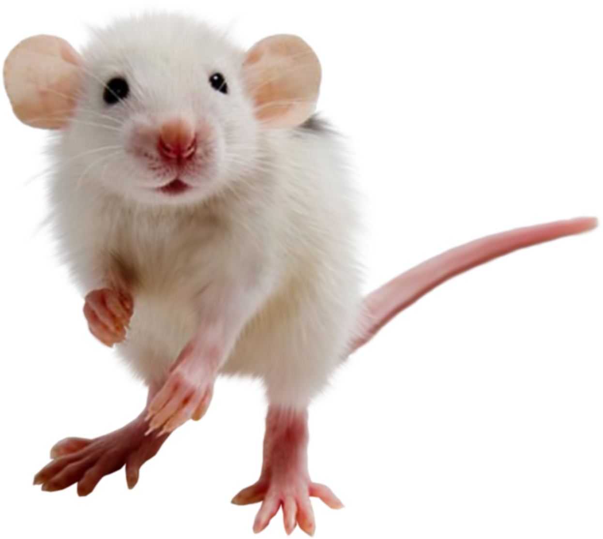
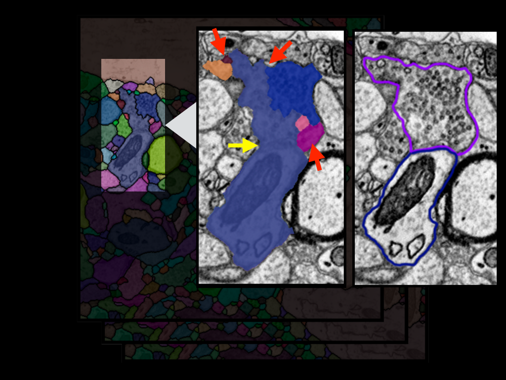
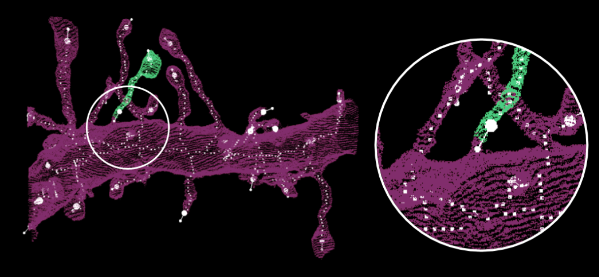
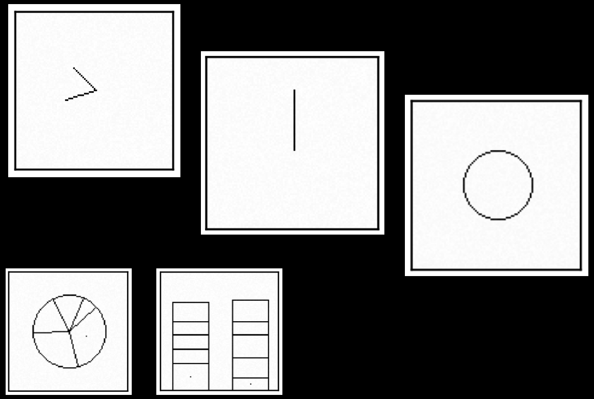

<!-- (c) Daniel Haehn, https://danielhaehn.com, contact me for questions! -->

Note: Good Afternoon!  We do not fully understand the brain and machine learning methods
  brain is superior to artificial int.  For instance, CNNs work extremely well, but can't generalize, reason, or understand is somewhat limited.  And the brain can do that  That's why we should try to understand it better
---

<iframe id='xtk0' style='position:fixed; top:0px; left:0px; width:100%; height:100%;' data-src='kasthuri3d/'></iframe>

Note: I am big fan of micro-scale connectomics.  In a few seconds NEURONS will pop up traced in high-res images spiny dendrites and the long axons manually annotated, took months. subset of 3 cylinders

---

<video width="100%" height="100%" autoplay muted>
  <source src="cylindervideo/video.mp4" type="video/mp4">
</video>

Note: This is the goal  note the variety of shapes that were manually segmented..  we don't even know how many neuron types really exist yet  we need autom processing but it is hard!

---

<iframe id='3dxp0' style='position:fixed; top:0px; left:0px; width:100%; height:100%;' data-src='100microns/'></iframe>

Note: 20 largest neurons in a 100 micron volume of tissue. automatically segmented just the images are 2 terabytes imagine a dense segmentation.. it is hard let's look again at some manual segmentation

---

Note: our algorithm thought that this is one single neuron.. we call it the hairball.  but how do we even get the data in the first place?

---

Note: well... we take mice, rats, or humans  cut out their brains or pieces of it  slice it extremely thinly  ...and scan it with an electron microscope  this happens in 2D!

---

<video width="100%" height="100%" autoplay muted>
  <source src="animaltobrainscan/bobbyzoom.mp4" type="video/mp4">
</video>

Note: ...and we end up with image slices that get aligned to volumes.  Now we need to find the cell membranes.

---

Note: We do this automatically and there are a variety of different methods  U-Nets and watershed, over floodfilling networks, affinity-based approaches, Seere Lab  but the automatic segmentations are not perfect

---

Note: let's take a closer look and zoom in

---

Note: because there are nice errors here

---

Note: please focus on these labels and the regions marked with arrows

---

Note: these are two cells and the membranes are shown here.  the labeling should look different

---

Wrong

Correct

Note: like that...  (click 2x) How do we get from the wrong labeling on the left to the correct labeling on the right?

---

Note: And the answer is proofreading by humans.

---

Split Error
Merge Error
<svg width='100%' height='400' style='margin-left:50px'>
    <!-- Split Error -->
    <rect class='fragment fade-in' data-fragment-index="2" width="150" height="100" x="0" y="0" fill="hotpink"></rect>
    <rect class='fragment fade-in' data-fragment-index="2" width="150" height="100" x="150" y="0" fill="yellow"></rect>
    <polygon class='fragment fade-in' data-fragment-index="3" points="350,40 369.5,40 369.5,30 389,45.5 369.5,61 369.5,52 350,52" fill="rgb(255, 255, 255)"></polygon>
    <rect class='fragment fade-in' data-fragment-index="4" width="300" height="100" x="450" y="0" fill="hotpink"></rect>
    <!-- Merge Error -->
    <rect class='fragment fade-in' data-fragment-index="5" width="300" height="100" x="0" y="200" fill="hotpink"></rect>
    <polygon class='fragment fade-in' data-fragment-index="6" points="350,240 369.5,240 369.5,230 389,245.5 369.5,261 369.5,252 350,252" fill="rgb(255, 255, 255)"></polygon>
    <rect class='fragment fade-in' data-fragment-index="7" width="250" height="100" x="450" y="200" fill="hotpink"></rect>
    <rect class='fragment fade-in' data-fragment-index="7" width="50" height="100" x="700" y="200" fill="cyan"></rect>    
</svg>

Note: One way to correct these errors is interactively.

---

 Raveler

Note: Raveler, Expert Tool by Janelia  room full of proofreaders

---

 Mojo

Note: Mojo, in-house software  windows only

---

 Eyewire

Note: Citizen science  for less complex data and only split errors  others are webknossos, or mozak

---

<iframe id='gp0' style='position:fixed; top:0px; left:0px; width:100%; height:100%;' data-src='http://localhost:1337/dojo/'></iframe>

D. Haehn, S. Knowles-Barley, M. Roberts, J. Beyer, N. Kasthuri, J.W. Lichtman, and H. Pfister. <b>Design and Evaluation of Interactive Proofreading Tools for Connectomics.</b> <i>IEEE Transactions on Visualization and Computer Graphics (IEEE SciVis)</i>, 2014.

Note: Dojo Live Demo... slices 3D merge split  quantitative user study

---

Raveler vs. Mojo vs. Dojo  
30 Participants (17 female, avg. 27 years)
  
Small Dataset (400x400x10 voxels)

  
Fixed Timeframe (30 minutes)

Note: between subjects user study  from all walks of life  proofread a representative dataset in a fixed time frame of 30 minutes  and surprise: most people made the initial segmentation worse!!

---

Baseline

Note: We measure how well users correct the segmentations by comparing against the ground truth.  VI, the lower, the better  Users of Dojo were able to fix more errors  we think: no parameters with dojo, a better 3D viewer, and a minimal user interface helped.. BUT

---

The visual search for errors takes a long time!

Note: Average correction time with Dojo was 30 seconds.  what if we can present errors to the user automatically?  we were not the only ones thinking along these lines...

---

 Focused Proofreading

Note: by Janelia, runs originally in Raveler and suggests errors to the user based on probabilities of a random forest classifier  we thought whether we can do that better

---

<iframe id='gp0' style='position:fixed; top:0px; left:0px; width:100%; height:100%;' data-src='http://140.247.107.121:21000/'></iframe>

D. Haehn, V. Kaynig, J. Tompkin, J.W. Lichtman, H. Pfister. <b>Guided Proofreading of Automatic Segmentations for Connectomics.</b> <i>IEEE Computer Vision and Pattern Recognition (CVPR)</i>, 2018.

<!-- (nolearn) d@viper:~/Projects/gp_TEST/ui (master@e896-)$>./ui.py 21000 /tmp/343242 GP -->

Note: The Guided Proofreading system  this way, we can reduce the correction time by a factor of 7.5times  CVPR 2018  so how do we suggest the errors? we train a convolutional neural network

---

Note: we train a pretty traditional classifier with  4 conv layers  to detect split errors only!  let's take a closer look at the inputs

---

 CNN suggests to merge

Note: we patch up our input data (slice by slice)  here an example split error  now 4 channel input (image, unet prob, merged labels, border mask)  cnn suggests to merge with a high score  so this works for split errors, but we re-use the same classifier for merge errors

---

Note: here is a merge error  there should be a boundary according to ground truth  soooo what we do is, we generate many different boundaries  and score each one with the classifier  if the classifier says it is a correct boundary (meaning not a split error)  this is most likely where the boundary was missing  

---

Focused Proofreading vs. Guided Proofreading  
20 Novices / 2 Experts
  
Same Dataset as before (400x400x10 voxels)

  
Fixed Timeframe (30 minutes)
  
Same User Interface

Note: another user study  again novices from the street  same dataset, again 30 minutes  instead of raveler, same user interface for FP and GP  and this time people proofread much better

---

Baseline

Note: again VI: the lower, the better, on the x-axis is the corrections over time  novices almost as good as experts  baseline is the input segmentation  since we used the same data as before, we can also compare against interactive proofreading with dojo

---

Baseline

Note: All novices here.  Dojo is fully interactive and GP is just so much better. Reducing the time for visual search by a factor of 7.5 pays off.  Takeaways...

---

Proofreading will always be necessary
  
Humans will be the bottleneck
  
Minimizing manual work is the goal
  

Note: Segmentation methods will not be perfect / we will always be uncertain to a degree because of the huge variability  before proofreading, lets find ways of automatically improving the segmentation  two methods under review  Dojo and Guided Proofreading open science (code/results/data) online

---

Machine Perception

 
 
 
 
 
 
 

Neurobiology

Note: I would like to now move from bottom-up neurobiology studies  to top-down machine perception research.  I will now talk about work we just presented at the IEEE Visualization conference in Berlin.  We test how CNNs are able to perceive simple graphical stimuli.

---

<iframe id='cnn0' style='position:fixed; top:0px; left:0px; width:100%; height:100%;' data-src='cnnangle/'></iframe>

D. Haehn, J. Tompkin, H. Pfister. <b>Evaluating 'Graphical Perception' with CNNs.</b> <i>IEEE Transactions on Visualization and Computer Graphics (IEEE Vis)</i>, 2018.

Note: For instance, here I can draw an angle.  and the VGG19 network estimates it  as you see that works pretty well  but what if we modify the stimuli?

---

<iframe id='cnn1' style='position:fixed; top:0px; left:0px; width:100%; height:100%;' data-src='cnnlength/'></iframe>

D. Haehn, J. Tompkin, H. Pfister. <b>Evaluating 'Graphical Perception' with CNNs.</b> <i>IEEE Transactions on Visualization and Computer Graphics (IEEE Vis)</i>, 2018.

Note: Here we draw two lines.  left: thin line  right: thick one  the network estimates the length

---

<iframe id='perception0' style='position:fixed; top:0px; left:0px; width:100%; height:100%;' data-src='https://docs.google.com/presentation/d/e/2PACX-1vSd_XkQInllkTc_IUDVVI5H3WH4ntbl98uCZCedtV9qXzbwdQGjOytlvXGlJClPkHGquWFbFGdbTqUZ/embed?start=false&loop=false&delayms=60000'></iframe>

---

Thank you!

  

<a href='https://danielhaehn.com/slides/brownCS'>danielhaehn.com/slides/brownCS</a>  
<small><a href='http://ratemytalk.com/MMPRL8'>RateMyTalk.com/MMPRL8</a></small>

Notes: Done and done

